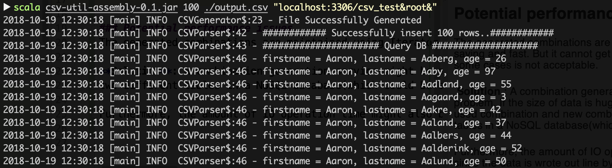

# csv-util

### Instructions
To run the program, find the jar named `csv-util-assembly-0.1.jar` at the top level of this project.

Make sure you have Scala and MySQL environment installed in your machine.

Run the command below in Shell. The first parameter indicates how much data you want to generate. The second is the path for the output file. The third one describes the DBUrl comprised of IP and port, DB name, username, and password.   
    
    scala csv-util-assembly-0.1.jar 100 ./output.csv "localhost:3306/csv_test&root&"
    
For simplicity, CSV generator and parser are combined together. The CSV generator will write different combinations 
of full names to the output csv file according to the given name data file in /src/main/resource. 
Afterwards, CSV parser would read the generated file and execute a series of SQL operations. 

The limit of data size and random ages could be manually changed in application.conf .

### Potential performance issues
The generated combinations are maintained using Iterator which is memory saving and fast. But it cannot get the previously iterated elements, which in some cases is not acceptable. 
    
**Solution**: A combination generation service might be able to solve this problem. If the size of data is huge, suppose billions of data records, the used combination and new combinations can be stored in 
two different tables in a NoSQL database(which could be easily scaled out than RDBMS).  

Furthermore, the amount of IO operation time might also be a problem, since the data is wrote out line by line. Using batch might a workaround.

### Test cases
Some test cases for DataGenerator can be found [here](./src/test/scala/DataGeneratorTest.scala)

**TODO**:
More test cases would be implemented in the future. Have many other quality tests to do. Sorry for that.